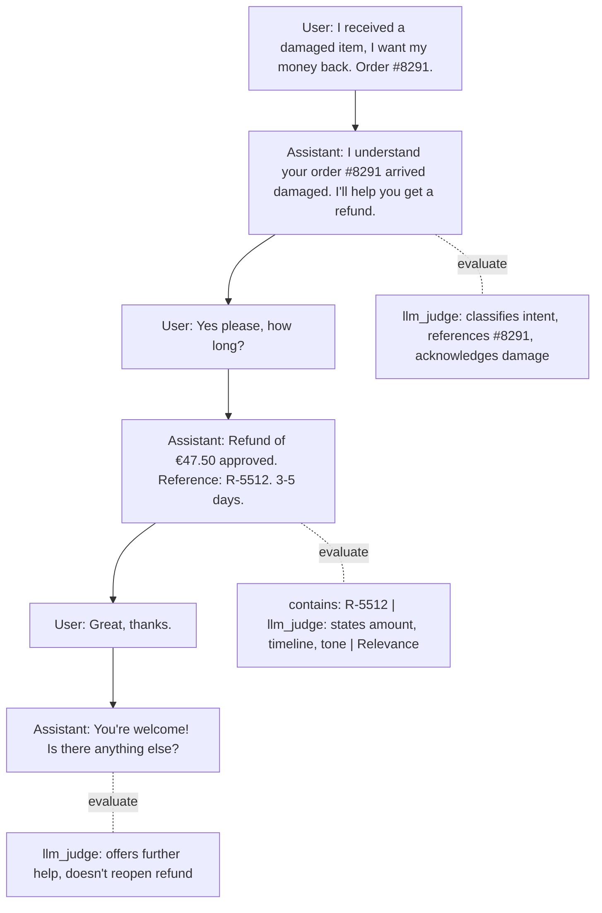
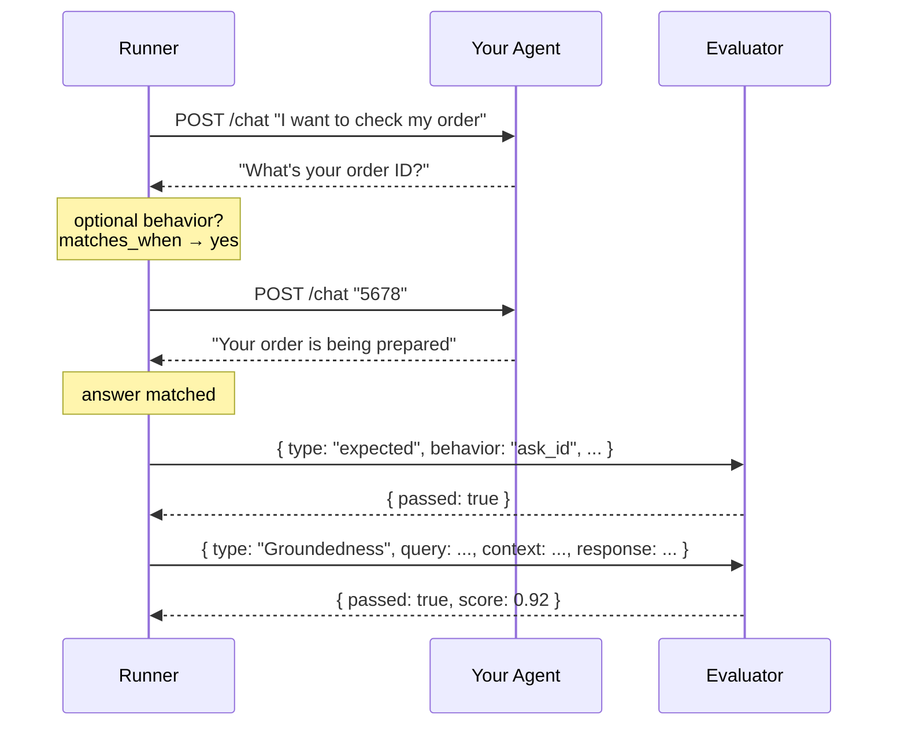

# **Agent Behavior Specification** (ABS)

> A vendor-neutral, human-readable format for describing the observable behavior of AI agents: what users say, what agents do, and how it should be evaluated.

**Status:** v0.1 — draft, open for review.

[](https://www.npmjs.com/package/abslang)
[](./LICENSE)

## What is **Agent Behavior Specification**?

**[Agent Behavior Specification](./SPECIFICATION.md)** (ABS) is a plain-text (YAML) format for describing agent behavior as an ordered sequence of observable actions — messages, tool calls, UI interactions, hand-offs — independent of the LLM provider, agent framework, orchestration engine, or tool protocol used to implement it.

It plays a role for agent behavior similar to what OpenAPI plays for HTTP APIs: a shared contract that developers, QA, product owners, and tooling can all read and act on.

### Quick example

Suppose you've been assigned this chatbot flow and need to evaluate it. Here's the conversation mapped out, with what you'd check at each assistant response — you've marked the evaluation points right on the graph:

A customer reports a damaged item. The agent handles the refund across three turns — classifying the request, processing the refund, and closing the conversation. **Five LLM-as-judge evaluations run across three distinct stages**, sharing the accumulated trace at each point.



So this is how you'd describe it in ABS:

```yaml
session: Damaged item → refund (multi-stage evaluation)
behaviors:
  # ── Turn 1: intent classification ──
  - actor: user
    action: says
    content: "I received a damaged item, I want my money back. Order #8291."

  - actor: assistant
    action: clarifies
    content: "I understand your order #8291 arrived damaged. I'll help you get a refund."
    evaluations:
      - type: llm_judge
        criteria: |
          1. Correctly classifies the intent as a refund request
          2. References the order number #8291
          3. Acknowledges the damage (not a simple return)
          4. Takes ownership of the resolution

  # ── Turn 2: resolution with delivery ──
  - actor: user
    action: says
    content: "Yes please, how long will it take?"

  - actor: assistant
    action: informs
    content: "Refund of €47.50 approved. Reference: R-5512. You'll receive it in 3-5 days."
    capture:
      refundId: "R-5512"
    evaluations:
      - type: contains
        value: "R-5512"
      - type: llm_judge
        criteria: |
          1. States the exact refund amount (€47.50)
          2. Provides the reference number R-5512
          3. Sets a clear timeline (3-5 days)
          4. Professional and empathetic tone
      - type: Relevance
        query: user
        response: self

  # ── Turn 3: closing ──
  - actor: user
    action: says
    content: "Great, thanks."

  - actor: assistant
    action: confirms
    content: "You're welcome! Is there anything else I can help with?"
    evaluations:
      - type: llm_judge
        criteria: |
          1. Offers further assistance
          2. Does NOT reopen the resolved refund
          3. Concise and natural

evaluations:
  - type: sequence
    order:
      - { actor: assistant, action: clarifies }
      - { actor: assistant, action: informs }
      - { actor: assistant, action: confirms }
  - type: variable_consistency
    variable: refundId
```

Six behaviors, three turns, five evaluations with external adapters across three stages — plus two chain evaluations (`sequence`, `variable_consistency`). Each `llm_judge` sees the trace accumulated so far: turn 1's judge only sees the clarification, turn 2's sees clarification + resolution, turn 3's sees the entire conversation. **Multi-stage evaluation in a single flow.**

### Ok, but how do I evaluate with multiple test scenarios?

Same session. Replace hardcoded values with `{{placeholders}}` and feed it a dataset:

```yaml
session: Damaged item → refund (parametrized)
dataset:
  id: cases
  path: cases.jsonl
behaviors:
  - actor: user
    action: says
    content: "{{cases.userMessage}}"

  - actor: assistant
    action: clarifies
    content: "{{cases.expectedClarification}}"
    evaluations:
      - type: llm_judge
        criteria: "{{cases.clarificationCriteria}}"

  - actor: user
    action: says
    content: "{{cases.followUp}}"

  - actor: assistant
    action: informs
    content: "{{cases.expectedResolution}}"
    capture:
      refundId: "{{cases.expectedRefundId}}"
    evaluations:
      - type: contains
        value: "{{cases.expectedRefundId}}"
      - type: llm_judge
        criteria: "{{cases.resolutionCriteria}}"
      - type: Relevance
        query: user
        response: self

  - actor: user
    action: says
    content: "{{cases.closing}}"

  - actor: assistant
    action: confirms
    content: "{{cases.expectedClosing}}"
    evaluations:
      - type: llm_judge
        criteria: "{{cases.closingCriteria}}"

evaluations:
  - type: sequence
    order:
      - { actor: assistant, action: clarifies }
      - { actor: assistant, action: informs }
      - { actor: assistant, action: confirms }
  - type: variable_consistency
    variable: refundId
```

A sample dataset (`cases.jsonl`) for the previous example could be something like this:

```jsonl
{"userMessage": "I received a damaged item, I want my money back. Order #8291.", "expectedClarification": "I understand your order #8291 arrived damaged...", "clarificationCriteria": "1. Classifies as refund\n2. References #8291\n3. Acknowledges damage\n4. Takes ownership", "followUp": "Yes please, how long?", "expectedResolution": "Refund of €47.50 approved. Reference: R-5512. 3-5 days.", "expectedRefundId": "R-5512", "resolutionCriteria": "1. States amount €47.50\n2. Reference R-5512\n3. Timeline 3-5 days\n4. Professional tone", "closing": "Great, thanks.", "expectedClosing": "You're welcome! Anything else?", "closingCriteria": "1. Offers further help\n2. Doesn't reopen refund\n3. Concise"}
{"userMessage": "My order #3412 arrived broken, refund please.", "expectedClarification": "Sorry about order #3412 arriving broken...", "clarificationCriteria": "1. Classifies as refund\n2. References #3412\n3. Acknowledges breakage\n4. Takes ownership", "followUp": "How fast is the refund?", "expectedResolution": "Refund of €32.00 approved. Reference: R-7811. 5-7 business days.", "expectedRefundId": "R-7811", "resolutionCriteria": "1. States amount €32.00\n2. Reference R-7811\n3. Timeline 5-7 days\n4. Professional tone", "closing": "Thanks!", "expectedClosing": "You're welcome! Anything else I can do?", "closingCriteria": "1. Offers further help\n2. Doesn't reopen refund\n3. Concise"}
{"userMessage": "Wrong item in my box for order #5567, I want a refund.", "expectedClarification": "I see order #5567 had the wrong item...", "clarificationCriteria": "1. Classifies as refund\n2. References #5567\n3. Acknowledges wrong item\n4. Takes ownership", "followUp": "Yes, go ahead.", "expectedResolution": "Refund of €89.99 approved. Reference: R-3394. 3-5 days.", "expectedRefundId": "R-3394", "resolutionCriteria": "1. States amount €89.99\n2. Reference R-3394\n3. Timeline 3-5 days\n4. Professional tone", "closing": "Perfect, thanks.", "expectedClosing": "Glad to help! Anything else?", "closingCriteria": "1. Offers further help\n2. Doesn't reopen refund\n3. Concise"}
```

Three rows, three runs, same multi-stage evaluation.

## Can I test optional actions and alternative paths?

Yes. Sometimes in a chatbot session the user gives data upfront — an order ID, an email — and sometimes they don't. Other times the agent itself must choose a path — process the request or escalate to a human. You can describe both kinds of uncertainty in a single session: mark those steps as `optional: true`, and the runner observes what the agent actually does.

Here's the same order lookup flow, now testing that the agent asks for an ID when the user didn't provide one:

```yaml
session: Order lookup — missing data detection
abs_version: "0.2"
dataset:
  id: cases
  path: cases.jsonl
behaviors:
  - id: user_asks
    actor: user
    action: says
    content: "{{cases.userQuery}}"

  - id: ask_id
    actor: assistant
    optional: true
    matches_when:
      type: llm_judge
      criteria: "The agent is requesting the order ID"
    evaluations:                              # ← runs only if the step matched
      - type: llm_judge
        criteria: "Politely asks, explains why the ID is needed"

  - id: user_gives_id
    actor: user
    action: says
    content: "{{cases.orderId}}"
    requires: ask_id

  - id: answer
    actor: assistant
    action: informs
    content: "{{cases.expectedAnswer}}"

evaluations:
  - type: expected
    behavior: ask_id
    when: "{{cases.hasOrderId}} == false"
    reason: "Agent should ask for ID when user doesn't provide it"

  - type: never
    match: { actor: assistant, action: asks }
    when: "{{cases.hasOrderId}} == true"
```

The `optional` step only activates if the agent actually asks. The `expected` evaluator checks that it *should* have asked when `hasOrderId` is `false`. The `never` evaluator checks that it *shouldn't* have asked when the user already gave the ID. And when the agent does ask, you can validate *how* it asks — right on the optional step itself. Both paths in one session, validated by the same dataset:

```jsonl
{"hasOrderId": false, "userQuery": "I want to check my order",       "orderId": "5678", "expectedAnswer": "Being prepared"}
{"hasOrderId": true,  "userQuery": "Where is order #8291?",          "orderId": "8291", "expectedAnswer": "On its way"}
{"hasOrderId": false, "userQuery": "Can you look up an order for me?", "orderId": "9999", "expectedAnswer": "Shipped today"}
{"hasOrderId": true,  "userQuery": "Status of #1234 please",         "orderId": "1234", "expectedAnswer": "Delivered"}
```

### The whole thing, in one place

So, bringing it all together — dataset-driven, optional actions, and evaluations both on individual steps and across the whole flow:

```yaml
session: Order lookup chatbot — complete
abs_version: "0.2"
dataset:
  id: cases
  path: cases.jsonl
behaviors:
  # Step 1: user asks — comes from dataset
  - id: user_asks
    actor: user
    action: says
    content: "{{cases.userQuery}}"

  # Step 2: agent may or may not ask for ID — depends on the situation
  - id: ask_id
    actor: assistant
    optional: true
    matches_when:
      type: llm_judge
      criteria: "The agent is requesting the order ID"
    evaluations:
      - type: llm_judge
        criteria: "Politely asks, explains why the ID is needed"

  # Step 3: only runs if the agent asked
  - id: user_gives_id
    actor: user
    action: says
    content: "{{cases.orderId}}"
    requires: ask_id

  # Step 4: agent answers — evaluated with Groundedness
  - id: answer
    actor: assistant
    action: informs
    content: "{{cases.expectedAnswer}}"
    evaluations:
      - type: Groundedness
        query: user_asks.says
        context: "{{cases.kbSnippet}}"
        response: self
        threshold: 0.8

# Session-level: validate the agent's decisions across the whole trace
evaluations:
  - type: expected
    behavior: ask_id
    when: "{{cases.hasOrderId}} == false"
    reason: "Agent should ask for ID when user doesn't provide it"

  - type: never
    match: { actor: assistant, action: asks }
    when: "{{cases.hasOrderId}} == true"

  - type: llm_judge
    criteria: "Overall conversation is helpful, professional, and resolves the user's request"
```

Pretty awesome, no?

## And can I actually test this?

Yes. We built `abslang` — a CLI that compiles `.abs.yaml` artifacts and executes them against your agent. Available for both ecosystems:

```bash
# TypeScript / Node.js
npm install -g abslang

# Python
pip install abslang
```

Run your first spec in 30 seconds:

```bash
abslang init
abslang run sessions/order-status.abs.yaml --agent http://localhost:8080/chat
```

**Don't want to write YAML?** Use the chatbot — describe the behavior in plain language and `abslang` generates the `.abs.yaml` for you:

```bash
abslang chat
# Uses OPENAI_API_KEY, ANTHROPIC_API_KEY, or DEEPSEEK_API_KEY — whichever is set
# You: A customer asks for a refund. The agent should verify the order, process it, and confirm.
# → generates a complete .abs.yaml with evaluations, datasets, and chain checks
```

### Under the hood

`abslang` calls your agent, captures the full trace, and hands it off to **evaluators** — pluggable checkers that verify specific things. An evaluator is a function that receives `{type, input, context, response, threshold}` and returns `{passed, score, reason}`.

Built-in evaluators run locally: `contains`, `regex`, `sequence`, `never`. LLM-based evaluators — `llm_judge`, `Groundedness`, `Relevance` — need an **adapter**, a small bridge to an evaluation service. ABS is adapter-agnostic: anyone can build and share an adapter for their service of choice. The evaluator **never calls your agent**; it only looks at the trace that was already captured. [Want to build one? Here's how →](./docs/adapter-guide.md)

Switch evaluators — or the LLM behind them — by changing one flag. Your session file never changes:



```bash
# Built-in judge (OpenAI, Anthropic, Gemini) — free, just set an env var
OPENAI_API_KEY=sk-... abslang run session.abs.yaml --agent $URL

# Private LLM — nothing leaves your network
abslang run session.abs.yaml --agent $URL --adapter llm_judge=local --adapter-url http://localhost:11434/v1

# External adapters — today AI Evaluator ships out of the box;
# Azure, LangSmith, Galileo, Promptfoo and others can be added
# by implementing the adapter contract (an afternoon of work)
abslang run session.abs.yaml --agent $URL --adapter llm_judge=aievaluator
```

Your session file never changes. Only the `--adapter` flag.

👉 [Explore the full docs and tutorials →](https://fvinciarelli.github.io/abslang/docs/)

## Documents

| Document | Purpose |
|---|---|
| [TUTORIAL.md](./TUTORIAL.md) | Step-by-step guide for QA — learn **Agent Behavior Specification** in 20 minutes |
| [MANIFESTO.md](./MANIFESTO.md) | Why **Agent Behavior Specification** exists, principles, what it is and isn't |
| [SPECIFICATION.md](./SPECIFICATION.md) | Formal v0.1 spec — document format, conformance |
| [CORE_MODEL.md](./CORE_MODEL.md) | Session, Behavior, Actor, Action, Target, Content, Variables, Evaluations |
| [VOCABULARY.md](./VOCABULARY.md) | Standard action vocabulary and semantics |
| [EVALUATIONS.md](./EVALUATIONS.md) | How Behaviors are verified |
| [VARIABLES.md](./VARIABLES.md) | Capture, reuse, and runtime binding of values |
| [COMPOSITION.md](./COMPOSITION.md) | Fragments and reusable Behaviors |
| [TOOLS.md](./TOOLS.md) | Tool interaction — `calls`, `responds`, matching rules |
| [RUNNER.md](./RUNNER.md) | How **Agent Behavior Specification** sessions get executed against a real agent |
| [CLI.md](./CLI.md) | `abslang init`, `abslang run`, `abslang report` — the command-line interface |
| [PATTERNS.md](./PATTERNS.md) | How to model real agent behaviors — recipes, not reference |
| [EXAMPLES.md](./EXAMPLES.md) | Worked, narrated examples |
| [ROADMAP.md](./ROADMAP.md) | What's next, and open design questions |
| [schema/abs.schema.json](./schema/abs.schema.json) | Normative JSON Schema for v0.2 document validation |
| [examples/](./examples/) | Runnable example sessions in `.yaml` |
| [.plans/branching-optional-behaviors.md](./.plans/branching-optional-behaviors.md) | v0.2 design: optional behaviors, branching |

## What's new in v0.2

v0.2 introduces **optional behaviors** — agent-driven branching without separate sessions. New concepts: `optional`, `requires`, `matches_when` (llm_judge / contains / regex), `expected` evaluator, `when` expressions, `after`. The runner now observes the agent's real decisions and validates whether they were correct, rather than following a rigid script. See [SPECIFICATION.md §7](./SPECIFICATION.md#7-optional-behaviors-v02) and the example above.

## Status of the standard

Closed in v0.2:
Optional Behaviors · `expected` evaluator · `matches_when` semantic matching · `when` expressions · batch optional resolution.

Closed in v0.1:
Scope · Session · Behavior · Actor · Action · Target · Content · Variables · Evaluations (step-level + chain-level) · Vocabulary · Sequencing · Fragments · Tool Interaction · JSON Schema · alternate flows as separate Sessions.

Implementations: TypeScript · Python · UI authoring tool (React) · Website (Next.js). See ROADMAP.md for open design questions.

## Contributing

This is a draft standard. Issues and proposals should reference which document and section they affect. See ROADMAP.md for the list of open questions actively being worked.

## License

Apache License 2.0 — see [LICENSE](./LICENSE).
